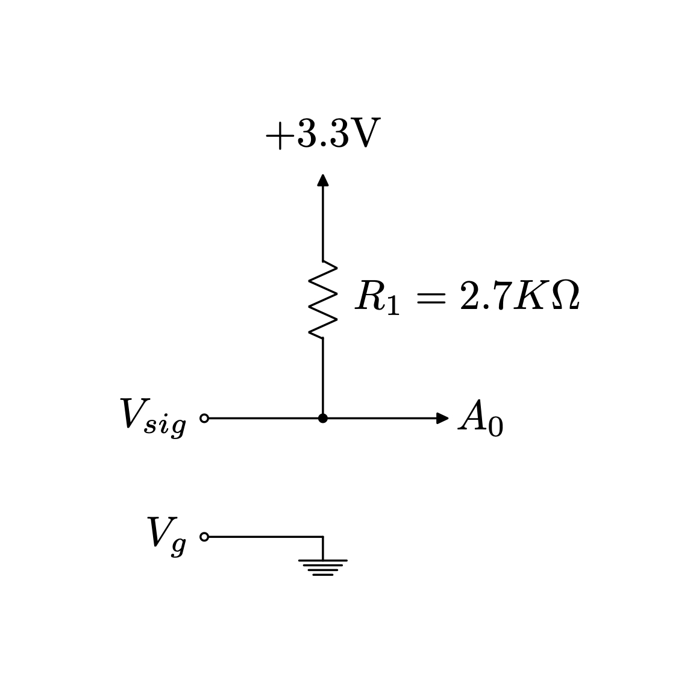

  <h3 align="center">🚴 bike [WIP]</h3>
  

The goal of this project is to capture and save RPM data from my cyclace excercise bike. This data can be used to calculate speed and distance througout the duration of excercise, which provides interesting information about the intensity of the excercise!

This all started when I noticed that the onboard display received some sort of signal input in a standard 3.5mm mono headphone jack. I enjoy collecting data about my life, particularly excercise, so figured it would be easy enough to build a device to capture this data which is typically "thrown away" by the onboard display after each workout. 

Note: sadly this cannot be done by treating the jack as a 3.5mm microphone input to a phone headphone jack because the pinouts do not line up as needed (would remove the need for building capture hardware). An adapter could be built, but I have microcontrollers laying around anyway so it's easy enough to proceed with some hardware!

## Current Progress
- [x] Determine bike sensor type (after some futzing, figured out that it's a [magnetic reed switch](https://en.wikipedia.org/wiki/Reed_switch))
- [x] Build initial circuit and microcontroller firmware to capture data, validate that rotations show up properly
- [ ] Write firmware to capture data from a workout
- [ ] Display current stats (distance, speed, duration) on a OLED display on device.
- [ ] Dump the data to an SD card or push it to a cloud server.
- [ ] ... more to come. 

## Hardware
The circuit needed here is pretty simple.

